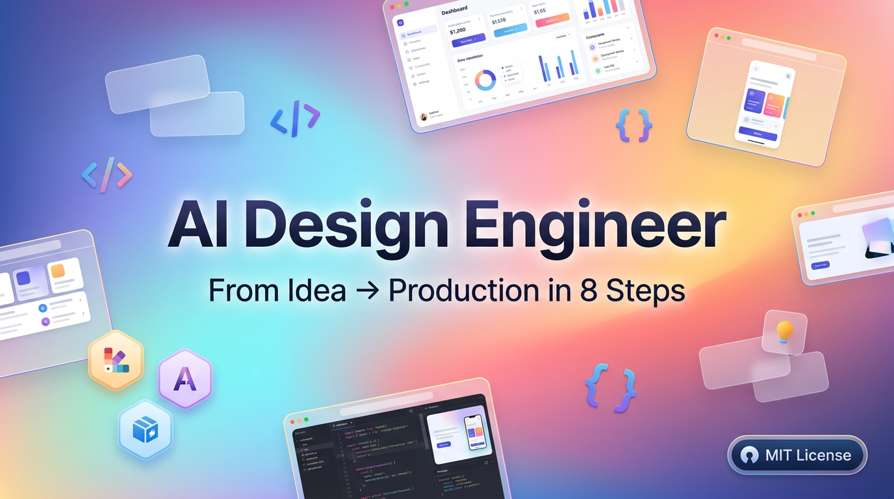
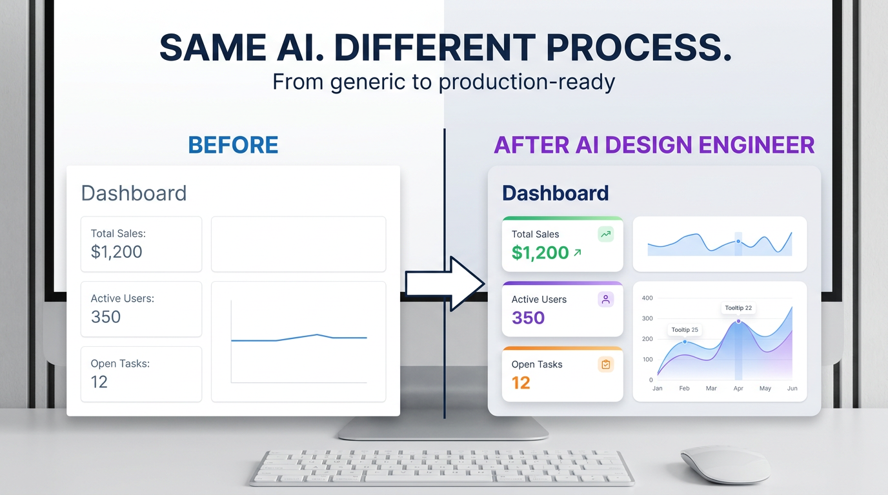
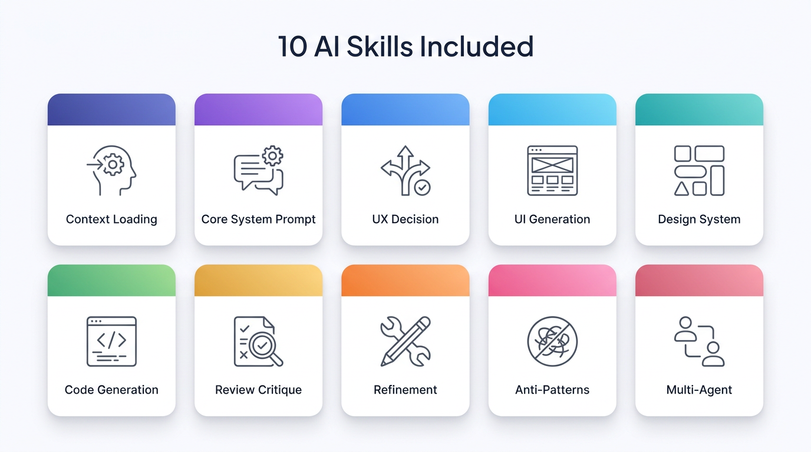

<!-- markdownlint-disable -->
<div align="center">

# 🤖 AI Design Engineer

### The open-source framework for AI-assisted design engineering
**From idea → UX → UI → code → review → production**

[](LICENSE)
[](CHANGELOG.md)
[](package.json)
[](skills/)
[](CONTRIBUTING.md)

[**Get started**](#-quick-start) · [**Examples**](examples/) · [**Docs**](https://gamemun01.github.io/ai-design-engineer/) · [**Discord**](https://discord.gg/aide)



</div>

---

## 💡 The problem

Most AI-generated UI looks great in a screenshot but breaks in production:

- 🎨 **No design system** — colors, spacing, typography all over the place
- 🚫 **Hero CTA invisible** — pretty visuals, no conversion
- ♿ **Inaccessible by default** — divs onClick, no ARIA
- 🧱 **Spaghetti code** — 5,000-line components, no structure
- 🐛 **"Almost works"** — 4 instances of `any`, console.logs in prod

**AI Design Engineer** fixes this with an **8-phase framework** + **10 specialized skills** that make the human the strategic decision-maker and the AI the executor.

---

## ✨ Before vs After



| Dimension | Without framework | With framework |
|---|---|---|
| **Production-ready** | ❌ Needs rewrite | ✅ Drop-in |
| **Score (0-120)** | ~45 | ~107 |
| **Accessibility** | 4/15 | 13/15 |
| **Design system** | 3/15 | 14/15 |
| **Code quality** | 7/15 | 13/15 |
| **Time to ship** | Days of cleanup | Hours |

See the [full comparison](examples/01-saas-landing/) including source code.

---

## 🏗 The 8-Phase Pipeline


| # | Phase | Lead | Output |
|---|-------|------|--------|
| 1 | **Foundation** | 🧑 Human | Mindset, rules, brand context |
| 2 | **UX Thinking** | 🧑 Human | User journey, IA, content brief |
| 3 | **Prompt Engineering** | 🤝 Hybrid | 8-layer prompts ready for AI |
| 4 | **Design System** | 🤝 Hybrid | Tokens, components, contracts |
| 5 | **UI Generation** | 🤖 AI | High-fidelity wireframes + variations |
| 6 | **AI-to-Code** | 🤖 AI | React/Next.js + TS + Tailwind + shadcn/ui |
| 7 | **Review & Critique** | 🧑 Human | 0-120 scorecard, blocker list |
| 8 | **Production Patterns** | 🤝 Hybrid | A11y, SEO, perf, observability |

[Read the deep dive →](docs-site/docs/framework/phases.md)

---

## 🛠 10 Skills Included



| Skill | Purpose | Token cost |
|---|---|---|
| [`core-system-prompt`](skills/foundation/core-system-prompt/) | Set AI role, rules, tone | ~800 |
| [`prompt-context-loading`](skills/foundation/prompt-context-loading/) | Load project context efficiently | ~600 |
| [`ux-decision-framework`](skills/ux/ux-decision-framework/) | UX thinking before UI | ~1,400 |
| [`ui-generation-structured`](skills/ui/ui-generation-structured/) | Generate UI variations systematically | ~1,200 |
| [`design-system-governance`](skills/ui/design-system-governance/) | Enforce tokens & component contracts | ~1,000 |
| [`code-generation`](skills/code/code-generation/) | Code templates per stack | ~1,800 |
| [`review-critique`](skills/quality/review-critique/) | 0-120 scorecard | ~900 |
| [`refinement-workflow`](skills/quality/refinement-workflow/) | Iterate without regressing | ~700 |
| [`anti-patterns-detector`](skills/quality/anti-patterns-detector/) | Block bad output early | ~1,100 |
| [`multi-agent-workflow`](skills/orchestration/multi-agent-workflow/) | Coordinate multiple AI agents | ~1,500 |

See [`skills/SKILL_MATRIX.md`](skills/SKILL_MATRIX.md) for which to load when.

---

## ⚡ Quick Start

### Option A: Scaffold a new project (fastest)

```bash
npx create-ai-design-engineer my-saas
cd my-saas
```

The scaffolder creates a folder with the framework + a tool adapter for your IDE of choice.

### Option B: Clone the framework directly

```bash
git clone https://github.com/gamemun01/ai-design-engineer.git
cd ai-design-engineer
npm install
```

### Option C: Use the framework in an existing project

Copy the skills you need:

```bash
# For Claude Code
cp -r skills/ /path/to/your-project/.claude/skills/

# For Cursor
cp -r skills/ /path/to/your-project/.cursor/skills/
```

### 60-second workflow

1. **Load** `skills/foundation/core-system-prompt/SKILL.md` into your AI tool
2. **Load** `skills/foundation/prompt-context-loading/SKILL.md` and provide project context
3. **Run** the prompts from `02-prompting-patterns/` for your task
4. **Generate** UI with the `ui-generation-structured` skill
5. **Convert to code** with the `code-generation` skill
6. **Review** with the `review-critique` 0-120 scorecard
7. **Polish** with `refinement-workflow` and ship

---

## 🧩 Works with your favorite tools

| Tool | Adapter | Status |
|---|---|---|
| **Claude Code** | `.claude/` | ✅ Native |
| **Cursor** | `.cursor/rules` | ✅ Native |
| **Windsurf** | `.windsurf/rules` | ✅ Native |
| **VSCode + Copilot** | `.vscode/settings.json` | ✅ Native |
| **Claude.ai Projects** | Custom instructions | ✅ Manual |
| **Cline / Roo Code** | `.clinerules` | ✅ Compatible |
| **Generic** | System prompt | ✅ Compatible |

See [Tool adapters](docs-site/docs/getting-started/tools.md) for setup.

---

## 📚 Examples

| # | Example | Stack | Score |
|---|---------|-------|-------|
| [01](examples/01-saas-landing/) | SaaS landing page (before/after) | Next.js + TS + Tailwind + shadcn/ui | 46 → 107 |

[Browse all examples →](examples/)

---

## 🧪 Validation

The framework comes with validation scripts:

```bash
npm run validate-skill   # Check all SKILL.md files have required structure
npm run check-links      # Find broken internal links
npm run lint:md          # Markdown lint
```

CI runs all of these on every PR — see [`.github/workflows/ci.yml`](.github/workflows/ci.yml).

---

## 🗺 Roadmap

- [x] v1.0.0 — 8 phases, 10 skills, MIT license
- [x] v1.1.0 — `npx` scaffolder, GitHub Actions, docs site
- [ ] v1.2.0 — 5 more working examples (e-commerce, dashboard, mobile, docs site, blog)
- [ ] v1.3.0 — Skill test runner with golden outputs
- [ ] v2.0.0 — Plugin marketplace for community skills
- [ ] v2.1.0 — Visual regression integration (Chromatic / Percy)

> **Note on versioning:** The numbers above are **product versions** (matching
> `package.json`), not skill schema versions. Each skill's `version` field in its
> YAML frontmatter tracks the **skill schema version** independently (currently
> `2.1.0`). The two version tracks are unrelated.

See [open issues](https://github.com/gamemun01/ai-design-engineer/issues) for the full list.

---

## 🤝 Contributing

We welcome PRs for new skills, examples, bug fixes, and docs improvements.

Read [CONTRIBUTING.md](CONTRIBUTING.md) first. Quick rules:

1. Fork + create branch from `dev/feature`
2. Follow the existing structure
3. Run `npm run lint && npm run validate-skill` before opening PR
4. Update [CHANGELOG.md](CHANGELOG.md) under `[Unreleased]`

---

## 📄 License

MIT © [gamemun01](https://github.com/gamemun01) and contributors.

See [LICENSE](License) for the full text.

---

## 🙏 Acknowledgments

- The [Anthropic](https://anthropic.com) team for Claude Code and the skills spec
- The [shadcn](https://ui.shadcn.com) project for the design system foundation
- The [Tailwind](https://tailwindcss.com) team for tokens-first thinking
- All contributors and early adopters who push the framework forward

---

<div align="center">

⭐ **Star this repo** if AI Design Engineer helped you ship faster.

[GitHub](https://github.com/gamemun01/ai-design-engineer) · [Docs](https://gamemun01.github.io/ai-design-engineer/) · [Issues](https://github.com/gamemun01/ai-design-engineer/issues) · [Discord](https://discord.gg/aide)

</div>
