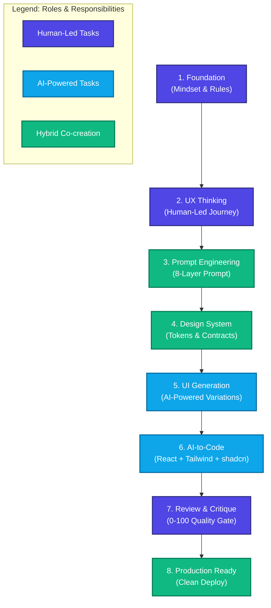

<!-- markdownlint-disable -->
# 🤖 AI Design Engineer Framework

<div align="center">

[](https://opensource.org/licenses/MIT)
[](https://nodejs.org/)
[](https://github.com/DavidAnson/markdownlint)
[](#6️⃣-ai-to-code-pipeline--06-ai-to-code)

**From Idea ➔ UX ➔ UI ➔ Component ➔ Code ➔ Review ➔ Production**

Framework ครบวงจรสำหรับสร้าง UI/UX ขั้นมืออาชีพด้วย AI — ไม่ใช่แค่การ Generate UI ที่สวยงามอย่างเดียว แต่เป็นการสร้างผลิตภัณฑ์ที่ใช้งานได้จริงในระดับ Enterprise

</div>

---

## 💡 Core Philosophy

> [!NOTE]
> **"AI มอบความเร็ว องค์ประกอบ และความหลากหลาย (Speed, Variations) — แต่ผู้ใช้ที่เป็นมนุษย์เป็นผู้ชี้นำความคิดผลิตภัณฑ์ การตัดสินใจเรื่อง UX สถาปัตยกรรม และการตัดสินคุณภาพขั้นสุดท้าย (Product Thinking, UX Decisions, Architecture, Quality Judgment)"**

---

## ✨ เปรียบเทียบผลลัพธ์ (How It Changes the Game)

| มิติ (Dimensions) | การทำงานทั่วไป (Traditional Generative UI) | ด้วย Framework นี้ (AI Design Engineer Method) |
| :--- | :--- | :--- |
| **🎯 โฟกัสหลัก** | เน้น UI ที่ดูสวยงามอย่างเดียว แต่ใช้งานจริงไม่ได้ | UX ที่ใช้งานได้จริง + UI คลีนตรงตามโทเค็นระบบ |
| **🔄 Workflow** | Design ➔ Generate โค้ดตรงๆ (ขาดการทบทวน) | UX Thinking ➔ Prompt Architecture ➔ AI Generation ➔ Quality Gates |
| **🎨 Design System** | ไม่มีระบบควบคุม โค้ดที่ได้จัดหน้าไม่ตรงตามมาตรฐาน | **AI-Friendly Design Tokens** + Strict Component Contracts |
| **💻 Code Output** | โค้ดสเก็ตช์/โครงสร้างซับซ้อน นำไปใช้จริงยาก | **Production-Ready React/Next.js + TS + Tailwind + shadcn/ui** |
| **🔍 Review Process** | ไม่มีเกณฑ์ชี้วัดคุณภาพ วัดตามความพึงพอใจบุคคล | **Structured Critique Framework (0-100 Scorecard)** |
| **📖 Case Studies** | คอนเซ็ปต์กว้างๆ ทั่วไป ไม่เห็นภาพหน้างาน | ตัวอย่างการใช้งานจริงในระดับ Enterprise (SaaS, Banking, AI App) |
| **⚠️ ป้องกันความผิดพลาด** | พึ่งพาความพร้อมของโมเดล (มีโอกาสเกิด Halucination) | **Explicit Anti-Patterns Guide** บล็อกโค้ดเสียก่อนขึ้นโปรดักชัน |

---

## 🏗️ Complete Framework Pipeline

กระบวนการออกแบบและพัฒนา 8 ขั้นตอนที่ช่วยให้การทำงานร่วมกับ AI มีประสิทธิภาพสูงสุด:



---

## 📚 โครงสร้างและเนื้อหาหลัก (8 Main Sections)

### 1️⃣ [Foundation](file:///D:/SourceCodeAll/repos/ToyHermes/ai-design-engineer/01-foundation) — `01-foundation/`
รากฐานแนวคิดและกฎพื้นฐานสำหรับ AI Design Engineer
> - บทบาทและความแตกต่างระหว่าง Human vs AI (ใครนำ ใครตาม)
> - Mindset ของการสร้างสรรค์ UI ร่วมกับ AI
> - การพิจารณาความพร้อมของระบบและการบริหารจัดการความเสี่ยง (Blast Radius)

### 2️⃣ [Prompt Engineering Patterns](file:///D:/SourceCodeAll/repos/ToyHermes/ai-design-engineer/02-prompting-patterns) — `02-prompting-patterns/`
เทคนิคการเขียน Prompt ด้วยโครงสร้าง 8 เลเยอร์ เพื่อการถอดรหัสของโมเดลอย่างแม่นยำ
> - **8-Layer Prompt Architecture**: ไล่ตั้งแต่ Product Context, User Context ไปจนถึง Technical Constraints
> - **Pattern Library**: เทมเพลตสำหรับ SaaS, Fintech, Healthcare, Admin Panel และ AI Agents

### 3️⃣ [UX Thinking](file:///D:/SourceCodeAll/repos/ToyHermes/ai-design-engineer/03-ux-thinking) — `03-ux-thinking/`
หัวใจสำคัญของงานออกแบบที่ AI ยังทดแทนไม่ได้และต้องให้มนุษย์นำทาง
> - การทำ User Journey Mapping และการวาง Task Flow
> - การควบคุม Cognitive Load และการจัดเรียง Information Architecture
> - การรับมือเคสพิเศษ (Edge Cases, Empty States, loading)

### 4️⃣ [Design System](file:///D:/SourceCodeAll/repos/ToyHermes/ai-design-engineer/04-design-system) — `04-design-system/`
ข้อกำหนดการออกแบบที่สอดคล้องกับมาตรฐานโค้ดของทีม
> - Design Tokens (Typography, spacing, colors, radius, shadows)
> - Component Contracts และแนวทาง Accessibility (a11y) มาตรฐาน WCAG 2.1 AA

### 5️⃣ [UI Generation](file:///D:/SourceCodeAll/repos/ToyHermes/ai-design-engineer/05-ui-generation) — `05-ui-generation/`
วิธีสร้างภาพหน้าจอและ UI component ด้วยเครื่องมือ Generative UI ชั้นนำ
> - แนวทางการใช้ v0, Lovable, 21st.dev และ Claude
> - UI Checklist เพื่อตรวจสอบความสอดคล้องของรูปแบบก่อนแปลงเป็นโค้ด

### 6️⃣ [AI-to-Code Pipeline](file:///D:/SourceCodeAll/repos/ToyHermes/ai-design-engineer/06-ai-to-code) — `06-ai-to-code/`
ทรานส์ฟอร์มจากภาพออกแบบสู่โค้ดโปรดักชันอย่างเป็นระบบ
> - **Core Stack:** React + TypeScript + Tailwind CSS + shadcn/ui
> - แผนผังการแปลงโทเค็นและโค้ดพร้อมรองรับ 5 UI States (Ideal, Loading, Empty, Error, Partial)

### 7️⃣ [Review & Critique](file:///D:/SourceCodeAll/repos/ToyHermes/ai-design-engineer/07-review-critique) — `07-review-critique/`
ระบบตรวจสอบคุณภาพแบบวัดผลได้ด้วยตัวเลข
> - การใช้ **0-100 Scorecard Checklist** วัดความผ่านเกณฑ์ของคุณภาพ Visual, UX และ Code
> - กฎเกณฑ์เข้มงวดในการระบุ Blocker และการส่งกลับเข้าสู่วงจรการปรับปรุง (Refinement Workflow)

### 8️⃣ [Production Ready](file:///D:/SourceCodeAll/repos/ToyHermes/ai-design-engineer/08-production-patterns) — `08-production-patterns/`
กรณีศึกษาจากผลิตภัณฑ์จริงที่จัดทำและใช้งานอยู่
> - แสดงการทำงานตั้งแต่เริ่มต้น: ปัญหา ➔ UX ➔ Prompt ➔ โค้ดและการขัดเกลาจนเสร็จสมบูรณ์

---

## 🛠️ Modular AI Prompt Skills (`skills/`)

ระบบนี้ออกแบบมาพร้อมกับ **Modular AI-Native Prompts** ที่พัฒนาและรันตรวจสอบอัตโนมัติ เพื่อให้ AI Agents หรือตัวคุณเองสามารถดึงไปใช้งานได้ทันที:

| สกิล (Skill Folder) | หน้าที่หลัก (Core Capability) | ไฟล์คำสั่งหลัก (Main Prompt File) |
| :--- | :--- | :--- |
| **💡 Core Prompt** | ตั้งค่า Role และข้อกำหนดพื้นฐานการทำงานร่วมกัน | [`skills/core-system-prompt/SKILL.md`](file:///D:/SourceCodeAll/repos/ToyHermes/ai-design-engineer/skills/core-system-prompt/SKILL.md) |
| **🧠 UX Decision** | ออกแบบ User Journey, Task Flow และระบบ Rationale | [`skills/ux-decision-framework/SKILL.md`](file:///D:/SourceCodeAll/repos/ToyHermes/ai-design-engineer/skills/ux-decision-framework/SKILL.md) |
| **🎨 UI Generation** | ควบคุม AI Generative UI ให้ได้ Component ตาม Rules | [`skills/ui-generation-structured/SKILL.md`](file:///D:/SourceCodeAll/repos/ToyHermes/ai-design-engineer/skills/ui-generation-structured/SKILL.md) |
| **📐 Design System** | ตรวจสอบการใช้งาน Tokens และ Components | [`skills/design-system-governance/SKILL.md`](file:///D:/SourceCodeAll/repos/ToyHermes/ai-design-engineer/skills/design-system-governance/SKILL.md) |
| **💻 Code Gen** | สร้างโค้ด React/Next.js + TS + shadcn/ui คุณภาพสูง | [`skills/code-generation/SKILL.md`](file:///D:/SourceCodeAll/repos/ToyHermes/ai-design-engineer/skills/code-generation/SKILL.md) |
| **🔍 Review Gate** | ตรวจสอบคะแนนคุณภาพ 0-100 Scorecard | [`skills/review-critique/SKILL.md`](file:///D:/SourceCodeAll/repos/ToyHermes/ai-design-engineer/skills/review-critique/SKILL.md) |
| **🔄 Refinement** | กระบวนการวนลูปแก้โค้ดและดีไซน์จนกว่าจะผ่านเกณฑ์ | [`skills/refinement-workflow/SKILL.md`](file:///D:/SourceCodeAll/repos/ToyHermes/ai-design-engineer/skills/refinement-workflow/SKILL.md) |
| **🚫 Anti-Patterns** | ดักจับโค้ดเสีย โค้ดขยะ และโครงสร้างที่ไม่ตรงมาตรฐาน | [`skills/anti-patterns-detector/SKILL.md`](file:///D:/SourceCodeAll/repos/ToyHermes/ai-design-engineer/skills/anti-patterns-detector/SKILL.md) |
| **🤖 Multi-Agent** | ประสานงานหลาย Agent ส่งมอบงานอย่างเป็นระบบ | [`skills/multi-agent-workflow/SKILL.md`](file:///D:/SourceCodeAll/repos/ToyHermes/ai-design-engineer/skills/multi-agent-workflow/SKILL.md) |

💡 อ่านรายละเอียดเพิ่มเติมและเลือกคู่มือใช้งานตามบริบทได้ที่ [Skill Matrix Guide](file:///D:/SourceCodeAll/repos/ToyHermes/ai-design-engineer/skills/SKILL_MATRIX.md)

---

## 🎯 แนวทางการศึกษาและใช้งาน (How to Use)

- **สำหรับ Design Leaders / Managers:** เริ่มต้นศึกษาจาก [Foundation](file:///D:/SourceCodeAll/repos/ToyHermes/ai-design-engineer/01-foundation) และ [Review & Critique](file:///D:/SourceCodeAll/repos/ToyHermes/ai-design-engineer/07-review-critique) เพื่อกำหนดกรอบการทำงานและคุณภาพของโปรเจกต์
- **สำหรับ Designers:** โฟกัสหลักที่ [UX Thinking](file:///D:/SourceCodeAll/repos/ToyHermes/ai-design-engineer/03-ux-thinking) และ [Prompt Engineering Patterns](file:///D:/SourceCodeAll/repos/ToyHermes/ai-design-engineer/02-prompting-patterns) เพื่อดึงประสิทธิภาพสูงสุดในการร่วมงานกับ AI
- **สำหรับ Developers:** มุ่งเน้นไปที่ [Design System](file:///D:/SourceCodeAll/repos/ToyHermes/ai-design-engineer/04-design-system) และ [AI-to-Code Pipeline](file:///D:/SourceCodeAll/repos/ToyHermes/ai-design-engineer/06-ai-to-code) พร้อมกับการใช้งานระบบลินเตอร์ตรวจสอบโค้ด

---

## 📖 Suggested Learning Roadmap

```
🚀 [Week 1] Foundation & UX Thinking  ➔  📂 01-foundation / 📂 03-ux-thinking
🔥 [Week 2] Prompt Patterns & 8-Layer ➔  📂 02-prompting-patterns
🎨 [Week 3] Design System & Tokens    ➔  📂 04-design-system
💻 [Week 4] UI Gen & Code Pipeline     ➔  📂 05-ui-generation / 📂 06-ai-to-code
🔍 [Week 5] Critique & Scorecard Gate ➔  📂 07-review-critique
🏁 [Week 6+] Ship Products (Enterprise)➔  📂 08-production-patterns
```

---

## ⚙️ Installation & Validation

### 1. ติดตั้ง Dependencies
```bash
npm install
```

### 2. ตรวจสอบคุณภาพ Prompt & Markdown (Linter & Validator)
```bash
# ตรวจสอบโครงสร้าง YAML frontmatter ของ Prompt สกิลทั้งหมด
npm run validate-skill

# ตรวจสอบรูปแบบและคุณภาพของไฟล์เอกสาร Markdown ทั้งโปรเจกต์ (รันบน Windows)
npx markdownlint-cli README.md AGENTS.md
```

### 3. รันเพื่อดูตัวอย่างเอกสารแบบ Local Preview
```bash
npm run preview
```

---

## 📂 Directory Layout

```text
ai-design-engineer/
├── 01-foundation/              # Foundations, role mapping
├── 02-prompting-patterns/      # 8-layer prompt architecture
├── 03-ux-thinking/             # UX strategy, journey flow
├── 04-design-system/           # Tokens, accessibility
├── 05-ui-generation/           # Tool template checklist
├── 06-ai-to-code/              # Tech stack & 5 UI states
├── 07-review-critique/         # Scoring gate (0-100 check)
├── 08-production-patterns/     # Enterprise case studies
├── skills/                     # Nested AI-Native Prompt Skills
│   ├── core-system-prompt/     # Global AI instruction setup
│   ├── ux-decision-framework/  # UX design prompt guidelines
│   ├── ui-generation-structured/# UI patterns and constraints
│   ├── design-system-governance/# Consistency and tokens checklist
│   ├── code-generation/        # Production-grade React/Next.js output
│   ├── review-critique/        # 0-100 scoring scorecard
│   ├── refinement-workflow/    # Iterative debug prompt
│   ├── anti-patterns-detector/ # Anti-pattern rules
│   ├── multi-agent-workflow/   # Multi-agent workflow protocols
│   ├── SKILL_MATRIX.md         # Framework skill index
│   └── deprecated/             # Relocated original flat files
├── assets/                     # UI blueprints & PNG visual assets
├── docs/                       # Shared documentation files
└── scripts/                    # Validation scripts & helpers
```

---

## 📖 Developer & Agent Guide

สำหรับผู้ใช้ที่เป็น AI Agent หรือต้องการพัฒนาต่อยอดระบบ:
* โปรดศึกษาแนวทางการเขียนโค้ดและข้อตกลงของ Repository ที่ [AGENTS.md](file:///D:/SourceCodeAll/repos/ToyHermes/ai-design-engineer/AGENTS.md)
* คู่มือด่วนสำหรับ Claude: [CLAUDE.md](file:///D:/SourceCodeAll/repos/ToyHermes/ai-design-engineer/CLAUDE.md)
* คู่มือด่วนสำหรับ Gemini: [GEMINI.md](file:///D:/SourceCodeAll/repos/ToyHermes/ai-design-engineer/GEMINI.md)

---

## 🤝 Contributing & Support

ยินดีต้อนรับทุกความช่วยเหลือและข้อเสนอแนะ! หากคุณมีไอเดียในการปรับปรุงหรือเพิ่มรูปแบบ Prompt หรือเนื้อหาใหม่ สามารถดำเนินการได้ดังนี้:
1. **Fork** Repository นี้ไปที่บัญชีของคุณ
2. สร้าง **Feature Branch** (เช่น `git checkout -b feature/cool-prompt`)
3. ทำการคอมมิตและตรวจสอบความถูกต้องด้วยคำสั่ง `npm run lint` และ `npm run validate-skill`
4. ส่ง **Pull Request** เพื่อตรวจสอบและรวมเข้าสู่สาขาหลักต่อไป

---

## 📜 License

โปรเจกต์นี้จัดทำขึ้นภายใต้เงื่อนไข **MIT License** — สามารถนำแนวคิด เทมเพลต และตัวอย่างทั้งหมดไปใช้งาน ปรับแต่ง หรือใช้งานในเชิงพาณิชย์ได้ฟรีโดยสมบูรณ์