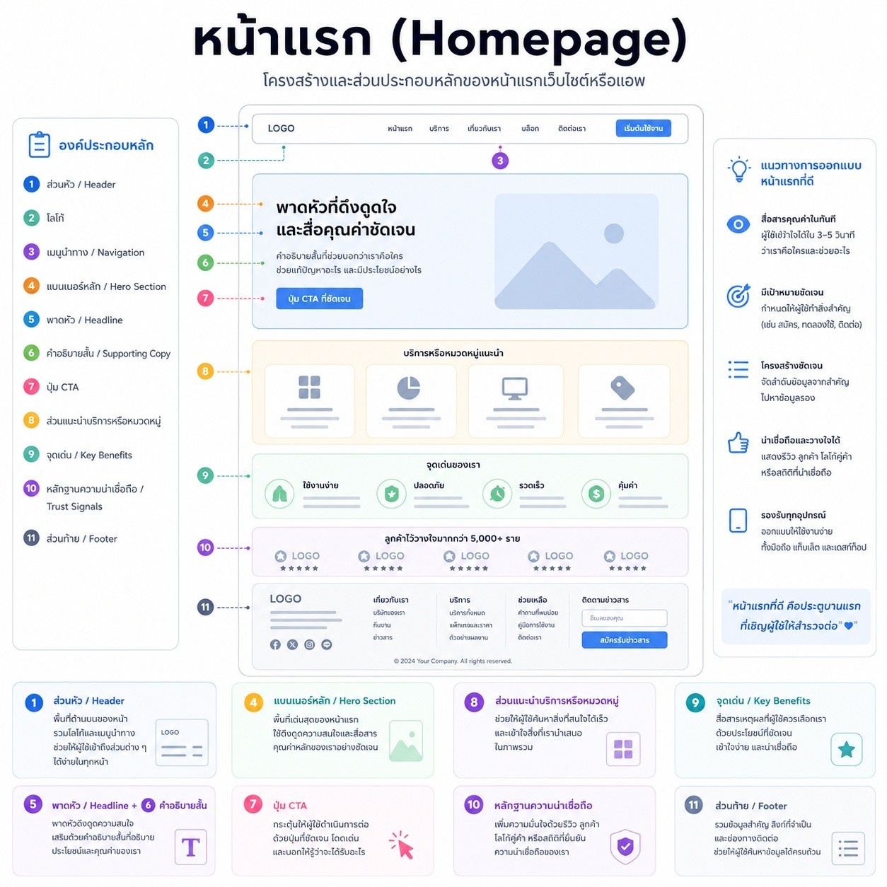
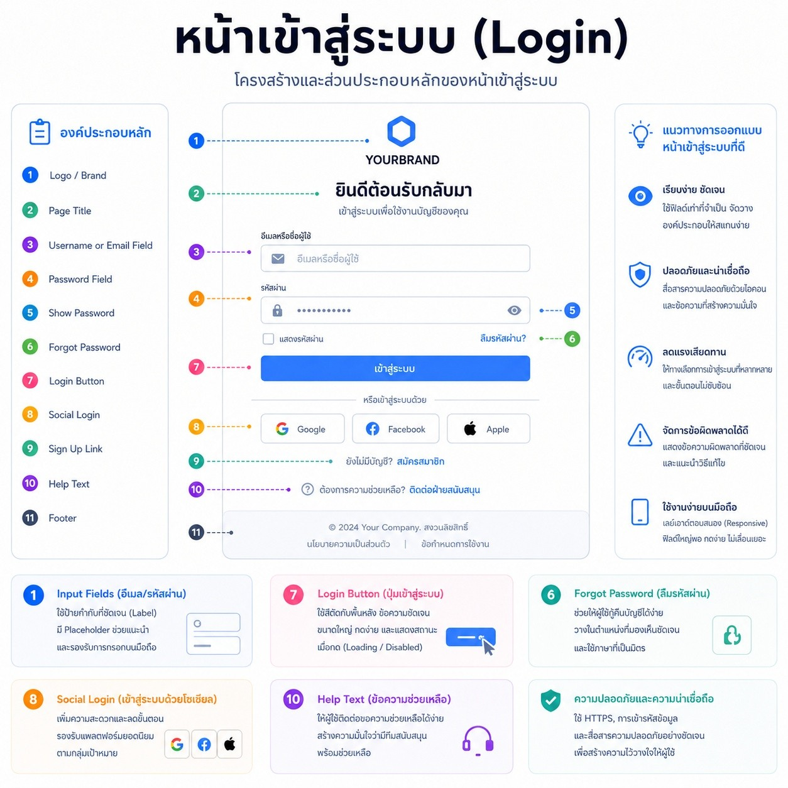
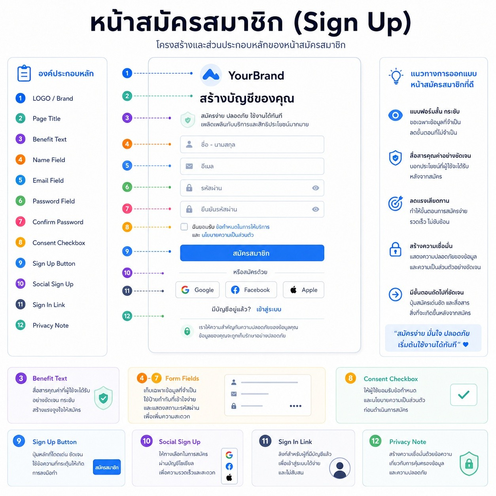
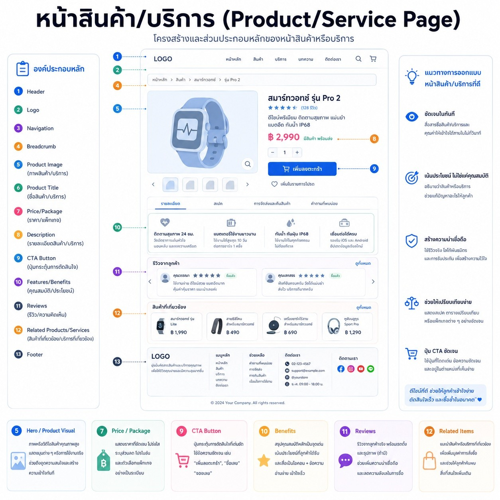
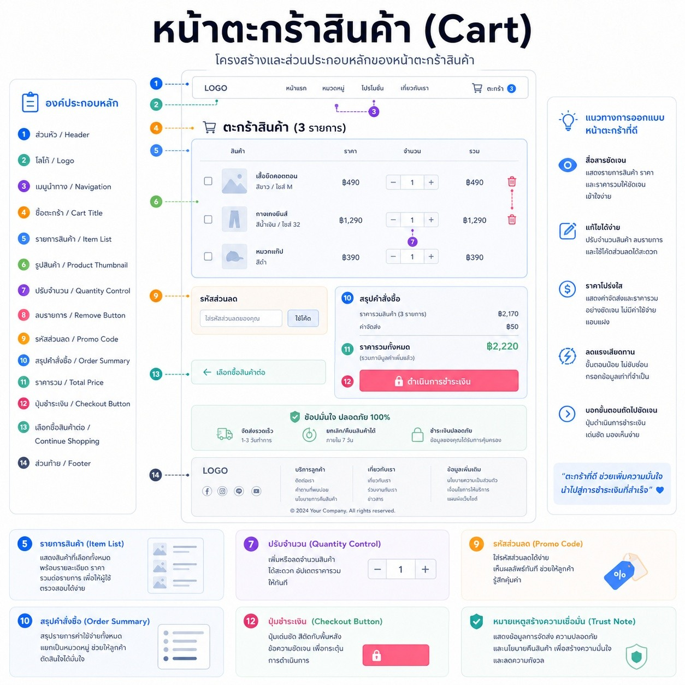
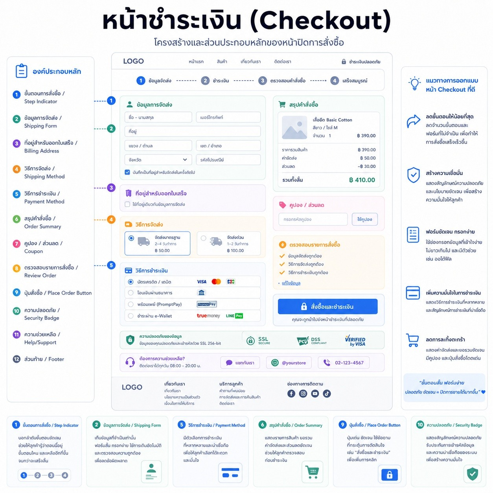
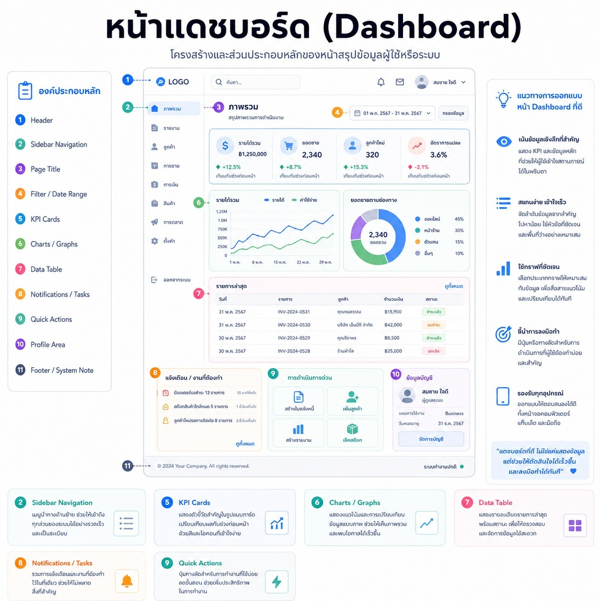
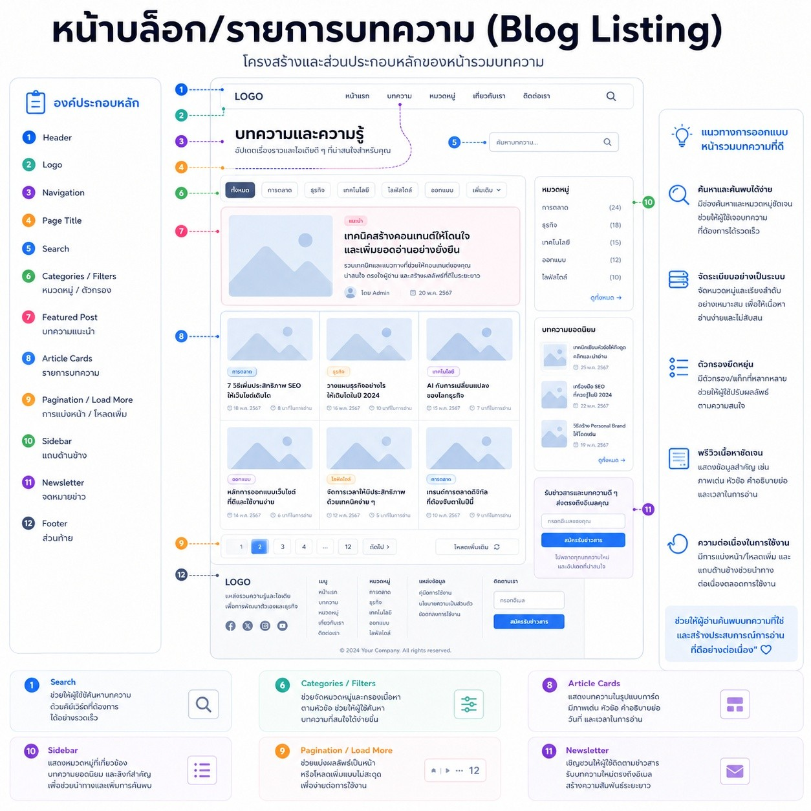
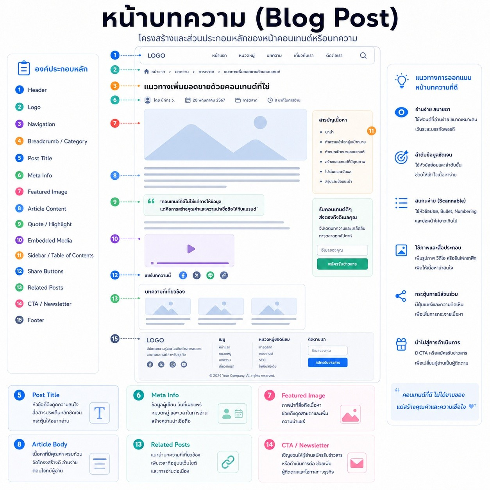
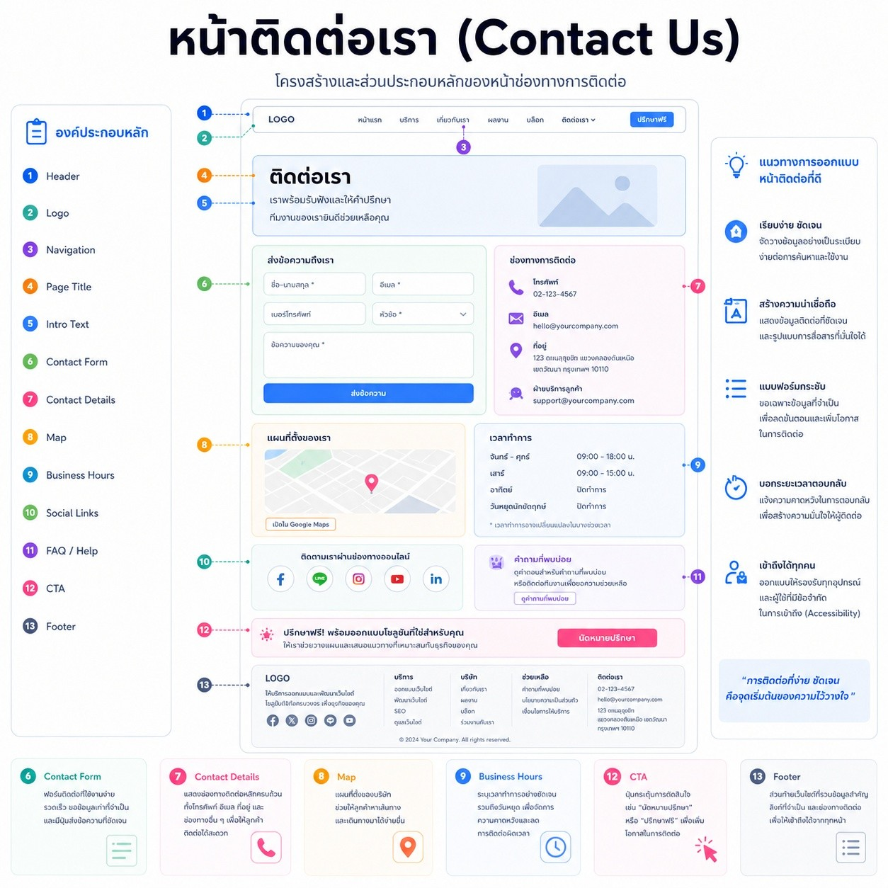

# AI Agent Skills Collection

คลังความรู้และชุดคำสั่ง (Prompt Engineering Skills) สำหรับยกระดับ AI Agent ให้มีทักษะเฉพาะทางขั้นสูง โดยเน้นสถาปัตยกรรม UI, Component-Based Design, และ output ที่พร้อมนำไปใช้จริง

## 📌 ภาพรวม

รีโพนี้รวบรวมสกิล AI สำหรับช่วยทีม UX/UI และนักพัฒนา Frontend สร้างอินเทอร์เฟซคุณภาพสูง ด้วยแนวทาง:
- UI Anatomy มาตรฐาน 10 หน้า
- การแบ่งคอมโพเนนต์ที่พร้อมใช้ซ้ำ
- Premium polish และ Frictionless UX

## 📚 เอกสารสำคัญ
- `skills/ai-design-engineer.md` — สกิลหลักสำหรับ AI-Augmented Design Engineer
- `docs/overview.md` — สรุปภาพรวมรีโพและการใช้งาน
- `assets/` — รูปภาพพิมพ์เขียว (blueprints) สำหรับ 10 หน้า UI

## 🚀 ทักษะที่มีให้ใช้งาน (Available Skills)

| Skill Name | Description | Target AI | Version |
| :--- | :--- | :--- | :--- |
| [AI-Augmented Design Engineer](./skills/ai-design-engineer.md) | สร้าง UI anatomy และ component-based structure สำหรับ 10 หน้าเว็บมาตรฐาน พร้อมคำแนะนำ UX/UI และการสไตล์หน้าเว็บ | ChatGPT, Claude, n8n, Hermes | 1.0.0 |

## 🎨 พิมพ์เขียวกายวิภาคทั้งหมด (UI Anatomy Blueprints)

คลังภาพอ้างอิงโครงสร้างอินเทอร์เฟซจากโฟลเดอร์ `assets/` ของโปรเจกต์นี้

| หน้าอินเทอร์เฟซ (UI Page) | รูปภาพพิมพ์เขียว (Blueprint Image Link) |
| :--- | :--- |
| 1. หน้าแรก (Homepage) |  |
| 2. หน้าเข้าสู่ระบบ (Login) |  |
| 3. หน้าสมัครสมาชิก (Sign Up) |  |
| 4. หน้าสินค้า/บริการ (Product Page) |  |
| 5. หน้าตะกร้าสินค้า (Cart) |  |
| 6. หน้าชำระเงิน (Checkout) |  |
| 7. หน้าแดชบอร์ด (Dashboard) |  |
| 8. หน้าบล็อก/รายการบทความ (Blog Listing) |  |
| 9. หน้าบทความ (Blog Post) |  |
| 10. หน้าติดต่อเรา (Contact Us) |  |

## 🛠️ วิธีนำไปใช้งาน (How to Use)

### 1. สำหรับ Custom GPTs (ChatGPT Plus)
1. ไปที่ **Explore GPTs** > **Create**
2. ในแท็บ **Configure** ให้คัดลอกเนื้อหาจากหัวข้อ `## 💻 System Instruction` ในไฟล์สกิลที่ต้องการ ไปใส่ในช่อง **Instructions**
3. เพิ่มคำสั่งในช่อง **Conversation starters** ตามตัวอย่างในหัวข้อ `## 🎯 Target Triggers & Keywords`

### 2. สำหรับ Claude Projects (Claude Pro)
1. สร้าง **Project** ใหม่ใน Claude
2. คัดลอกเนื้อหาในไฟล์สกิลทั้งหมดไปวางในส่วน **Set Custom Instructions**

### 3. สำหรับโค้ดดิ้งและเอเจนต์อัตโนมัติ (n8n, Hermes Agent, OpenClaw)
* นำเนื้อหาในส่วน `System Instruction` และ `Rules & Constraints` ไปใส่ในช่อง **System Message** หรือโปรแกรมคอนฟิกของตัว LLM Node

## 🔧 คำแนะนำเพิ่มเติม
- เริ่มจากอ่าน `skills/ai-design-engineer.md` เพื่อเข้าใจโครงสร้างและ output ที่คาดหวัง
- ใช้ภาพใน `assets/` เป็น reference เมื่อต้องการออกแบบหน้าเว็บตามแนวทาง UI anatomy
- เก็บคำสั่ง trigger และ slash command ไว้เป็น template เพื่อเรียกใช้ prompt ได้ไวขึ้น

## 🧰 Tooling

- ติดตั้ง dependencies ด้วย `npm install`
- ตรวจสอบ Markdown ด้วย `npm run lint`
- ตรวจสอบโครงสร้าง skill ด้วย `npm run validate-skill`
- เรียกดูเอกสารอย่างง่ายด้วย `npm run docs`
- เปิดรีโพในเว็บเซิร์ฟเวอร์ท้องถิ่นด้วย `npm run preview`

## 📚 เอกสารเพิ่มเติม (Documentation)

- ดูสรุปภาพรวมของรีโพได้ที่ `docs/overview.md`

## 🤝 การสนับสนุนและมีส่วนร่วม (Contributing)

หากต้องการเพิ่มสกิลใหม่ หรือปรับปรุงพิมพ์เขียวโครงสร้างให้ทันสมัย สามารถเปิด Pull Request (PR) เข้ามาได้ตลอดเวลา