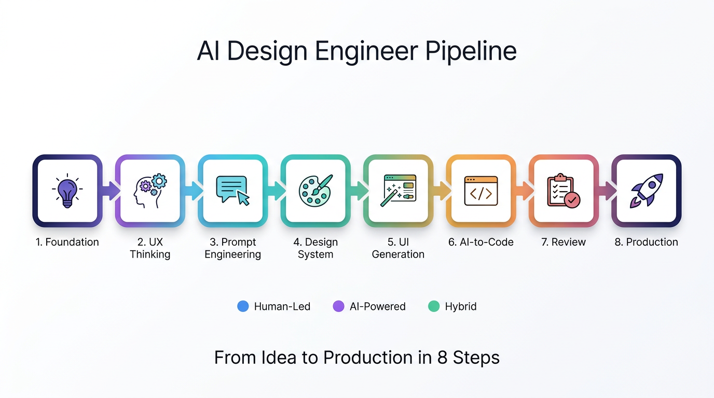

# AI Design Engineer

> **The open-source framework for AI-assisted design engineering.**
> From idea → UX → UI → component → code → review → production.

{ loading=lazy }

---

## ⚡ 60-second primer

Most AI-generated UI looks impressive in a screenshot but breaks in production. **AI Design Engineer** is a framework of 8 phases and 10 skills that fix this — by making the human the strategic decision-maker and the AI the executor.

| Without framework | With framework |
|---|---|
| Pretty mockup, no design system | Tokens enforced, components reusable |
| Hero looks done, CTA invisible | UX decisions made explicit before generation |
| Code "almost works" | 0-120 scorecard gate before ship |
| 5,000-line spaghetti component | < 200 lines per file, semantic, accessible |
| Re-generate to fix issues | Refinement workflow with regression checks |

## 🏗 8-Phase Pipeline

{ loading=lazy }

| # | Phase | Lead | Output |
|---|-------|------|--------|
| 1 | Foundation | Human | Mindset, rules, brand context |
| 2 | UX Thinking | Human | User journey, IA, content brief |
| 3 | Prompt Engineering | Hybrid | 8-layer prompts ready for AI |
| 4 | Design System | Hybrid | Tokens, components, contracts |
| 5 | UI Generation | AI | High-fidelity wireframes + variations |
| 6 | AI-to-Code | AI | React/Next.js + TS + Tailwind + shadcn/ui |
| 7 | Review & Critique | Human | 0-120 scorecard, blocker list |
| 8 | Production Patterns | Hybrid | A11y, SEO, perf, observability |

## 🛠 10 Skills Included

{ loading=lazy }

| Skill | Purpose |
|---|---|
| `prompt-context-loading` | Load project context into the AI |
| `core-system-prompt` | Set role, rules, tone |
| `ux-decision-framework` | Decide UX before UI |
| `ui-generation-structured` | Generate UI variations systematically |
| `design-system-governance` | Enforce tokens & component contracts |
| `code-generation` | Code templates per stack |
| `review-critique` | 0-120 scorecard |
| `refinement-workflow` | Iterate without regressing |
| `anti-patterns-detector` | Block bad output early |
| `multi-agent-workflow` | Coordinate multiple AI agents |

## 🚀 Get started

```bash
# Scaffold a new project
npx create-ai-design-engineer my-saas

# Or clone and explore
git clone https://github.com/gamemun01/ai-design-engineer.git
```

## 📚 What's next

<div class="grid cards" markdown>

- :material-rocket-launch: **[Quick start](getting-started/quickstart.md)**

    Build your first page in 10 minutes.

- :material-book-open: **[8 phases explained](framework/phases.md)**

    Deep dive into each phase with examples.

- :material-puzzle: **[Skill matrix](skills/matrix.md)**

    Which skills to load when, and at what cost.

- :material-code-tags: **[Working example](examples/01-saas-landing.md)**

    Full SaaS landing page — before vs after.

</div>

## 📄 License

MIT © [gamemun01](https://github.com/gamemun01) and contributors.
